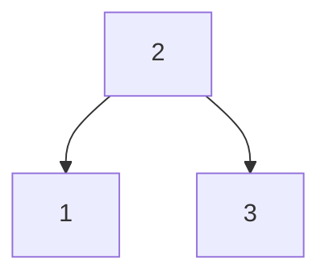
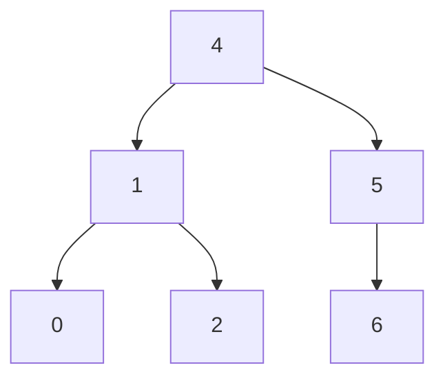

# 4.9 BST Sequences

A binary search tree was created by traversing through an array from left to right and inserting each element. Given a
binary search tree with distinct elements, print all possible arrays that could have led to this tree.

**EXAMPLE 1:**

**Input:**



**Output:** {2, 1, 3}, {2, 3, 1}

**EXAMPLE 2:**

https://stackoverflow.com/a/57948148

**Input:**



**Output:**

```
000: [4, 1, 0, 2, 5, 6]
001: [4, 1, 0, 5, 2, 6]
002: [4, 1, 0, 5, 6, 2]
003: [4, 1, 5, 0, 2, 6]
004: [4, 1, 5, 0, 6, 2]
005: [4, 1, 5, 6, 0, 2]
006: [4, 5, 1, 0, 2, 6]
007: [4, 5, 1, 0, 6, 2]
008: [4, 5, 1, 6, 0, 2]
009: [4, 5, 6, 1, 0, 2]
010: [4, 1, 2, 0, 5, 6]
011: [4, 1, 2, 5, 0, 6]
012: [4, 1, 2, 5, 6, 0]
013: [4, 1, 5, 2, 0, 6]
014: [4, 1, 5, 2, 6, 0]
015: [4, 1, 5, 6, 2, 0]
016: [4, 5, 1, 2, 0, 6]
017: [4, 5, 1, 2, 6, 0]
018: [4, 5, 1, 6, 2, 0]
019: [4, 5, 6, 1, 2, 0]
```

# Notes

>Note that the question is actually about topological sorting of a tree: find all the possible ways to perform
topological sort. That is, we don't care about the specific way the tree was built, what's important is that elements
are always added as leaves, never changing the structure of existing nodes. The constraint on the output is that nodes
never precede their ancestors - treating the tree as a classic dependency graph.
> 
> _from https://stackoverflow.com/a/60266326_
