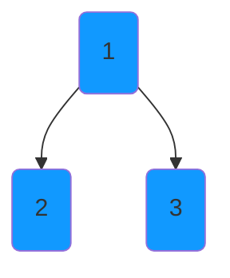
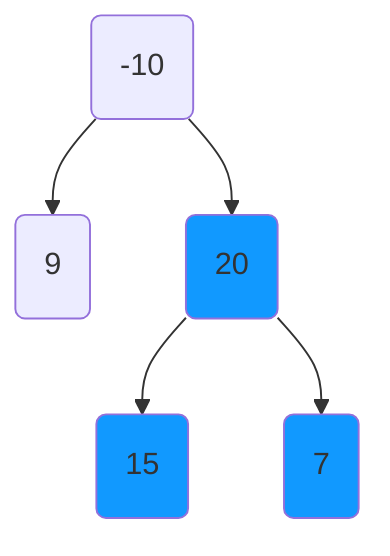

# Binary Tree Maximum Path Sum
https://leetcode.com/problems/binary-tree-maximum-path-sum/

Similar: `Longest Univalue Path`

A **path** in a binary tree is a sequence of nodes where each pair of adjacent nodes in the sequence has an edge 
connecting them. A node can only appear in the sequence **at most once**. Note that the path does not need to pass 
through the root.

The **path sum** of a path is the sum of the node's values in the path.

Given the `root` of a binary tree, return the maximum **path sum** of any **non-empty** path.

**Example 1:**

    Input: root = [1,2,3]
    Output: 6
    Explanation: The optimal path is 2 -> 1 -> 3 with a path sum of 2 + 1 + 3 = 6.

**Example 2:**

    Input: root = [-10,9,20,null,null,15,7]
    Output: 42
    Explanation: The optimal path is 15 -> 20 -> 7 with a path sum of 15 + 20 + 7 = 42.

**Constraints:**

    The number of nodes in the tree is in the range [1, 3 * 104].
    -1000 <= Node.val <= 1000

## Solution 1 - Recursive DFS
Maximum path of a binary tree graph given any node can be from it's left's leaf's children to right's leaf children (if 
any side's path is less than zero assume it's zero). If the max is found overwrite current max. Otherwise, return node's
max of left's path, node's right's path or zero (path's that do not add to a possible max value are useless).