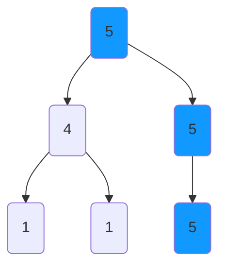
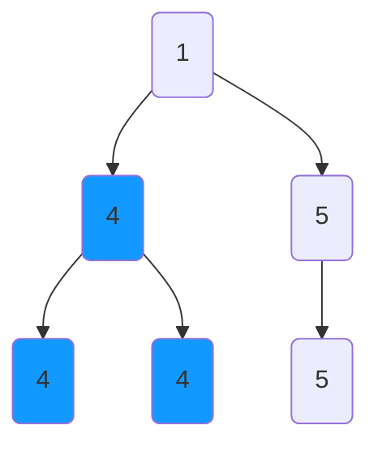

# Longest Univalue Path

Given the root of a binary tree, return the length of the longest path, where each node in the path has the same value.
This path may or may not pass through the root.

The length of the path between two nodes is represented by the number of edges between them.

**Example 1:**

    Input: root = [5,4,5,1,1,5]
    Output: 2

**Example 2:**

    Input: root = [1,4,5,4,4,5]
    Output: 2

**Constraints:**

    The number of nodes in the tree is in the range [0, 10^4].
    -1000 <= Node.val <= 1000
    The depth of the tree will not exceed 1000.

## Solution 1 - Recursive DFS
https://leetcode.com/problems/longest-univalue-path/discuss/108142/Python-Simple-to-Understand

Traverse down the graph with DFS return `max(left, right)` since the parent can only use one of the directions to follow
a proper path.