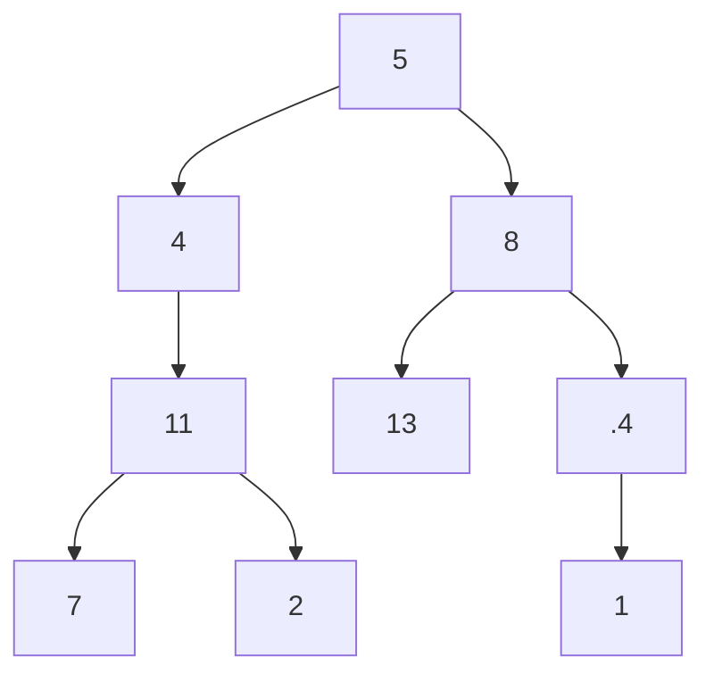
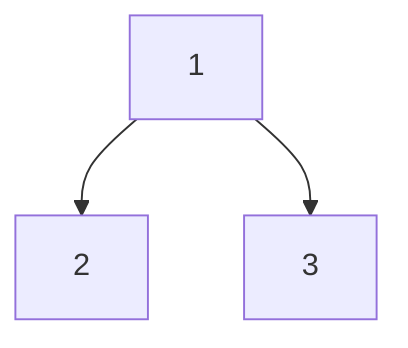
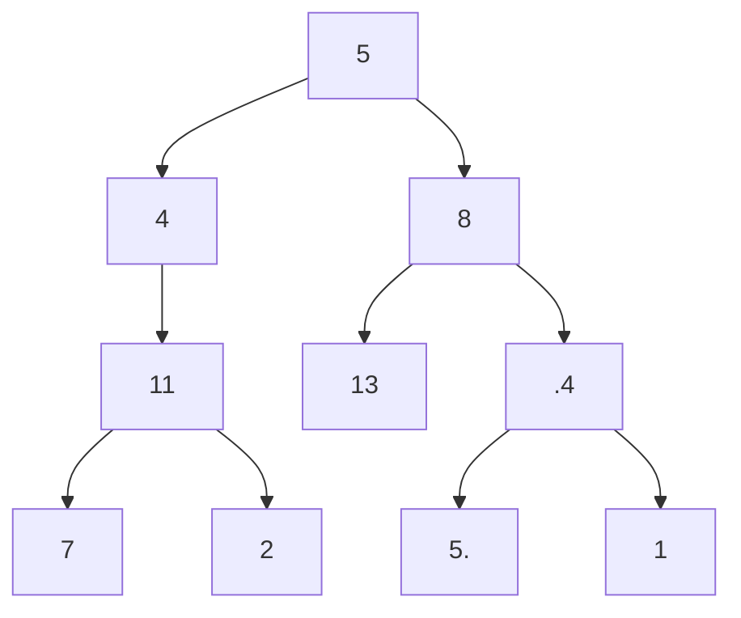
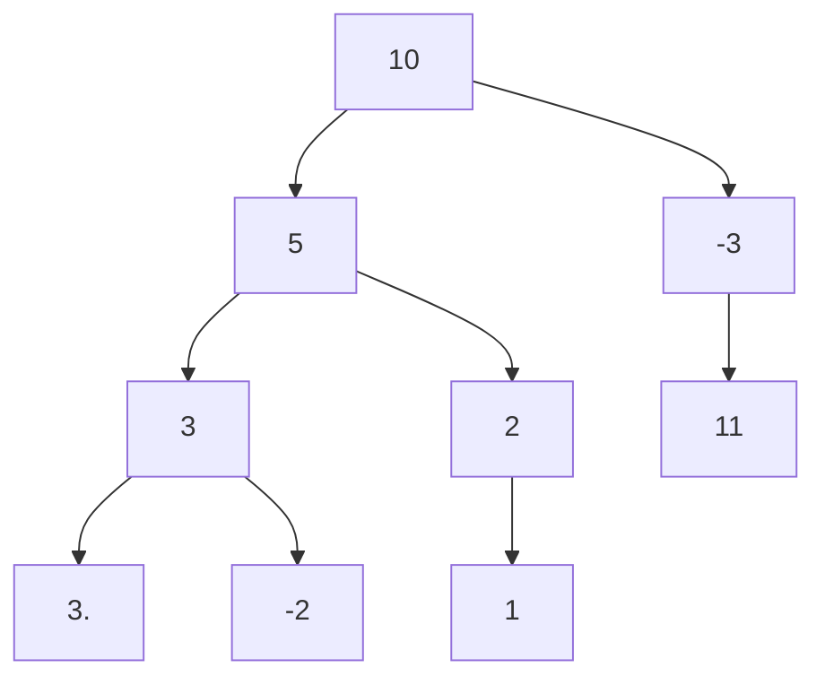

# Path Sum I
https://leetcode.com/problems/path-sum/

Given the `root` of a binary tree and an integer `targetSum`, return `true` if the tree has a **root-to-leaf** path such
that adding up all the values along the path equals `targetSum`.

A **leaf** is a node with no children.

**Example 1:**

    Input: root = [5,4,8,11,null,13,4,7,2,null,null,null,1], targetSum = 22
    Output: true
    Explanation: The root-to-leaf path with the target sum is shown.

**Example 2:**

    Input: root = [1,2,3], targetSum = 5
    Output: false
    Explanation: There two root-to-leaf paths in the tree:
    (1 --> 2): The sum is 3.
    (1 --> 3): The sum is 4.
    There is no root-to-leaf path with sum = 5.

**Example 3:**

    Input: root = [], targetSum = 0
    Output: false
    Explanation: Since the tree is empty, there are no root-to-leaf paths.

 

**Constraints:**

    The number of nodes in the tree is in the range [0, 5000].
    -1000 <= Node.val <= 1000
    -1000 <= targetSum <= 1000

## Solution 1 - DFS Recursively
Straightforward recursive DFS.

## Solution 2 - DFS with stack
Straightforward DFS with stack.

## Solution 2 - BFS with queue
Add children to the end of the queue then `pop(0)` to take the first element. Decrease target sum by val until it 
reaches zero.

# Path Sum II
https://leetcode.com/problems/path-sum-ii/

Given the `root` of a binary tree and an integer `targetSum`, return all **root-to-leaf** paths where the sum of the 
node **values** in the path equals `targetSum`. Each path should be returned as a list of the node **values**, not node 
references.

A **root-to-leaf** path is a path starting from the root and ending at any leaf node. A **leaf** is a node with no children.

**Example 1:**

    Input: root = [5,4,8,11,null,13,4,7,2,null,null,5,1], targetSum = 22
    Output: [[5,4,11,2],[5,8,4,5]]
    Explanation: There are two paths whose sum equals targetSum:
    5 + 4 + 11 + 2 = 22
    5 + 8 + 4 + 5 = 22

## Solution 1 DFS - Recursive
Adapted previous solution

# Path Sum III
https://leetcode.com/problems/path-sum-iii/

Given the `root` of a binary tree and an integer `targetSum`, return the number of paths where the sum of the values 
along the path equals `targetSum`.

The path does not need to start or end at the root or a leaf, but it must go downwards (i.e., traveling only from parent
nodes to child nodes).

**Example 1:**

    Input: root = [10,5,-3,3,2,null,11,3,-2,null,1], targetSum = 8
    Output: 3
    Explanation: The paths that sum to 8 are shown.

**Example 2:**

    Input: root = [5,4,8,11,null,13,4,7,2,null,null,5,1], targetSum = 22
    Output: 3

**Constraints:**

    The number of nodes in the tree is in the range [0, 1000].
    -109 <= Node.val <= 109
    -1000 <= targetSum <= 1000

## Solution 1 - DFS Recursively with memoization
https://leetcode.com/problems/path-sum-iii/discuss/141424/Python-step-by-step-walk-through.-Easy-to-understand.-Two-solutions-comparison.-%3A-)

1. In order to optimize from the brutal force solution, we will have to think of a clear way to memorize the intermediate result. Namely in the brutal force solution, we did a lot repeated calculation. For example `1->3->5`, we calculated: 1, 1+3, 1+3+5, 3, 3+5, 5.
2. This is a classical 'space and time tradeoff': we can create a dictionary (named `cache`) which saves all the path sum (from root to current node) and their frequency.
3. Again, we traverse through the tree, at each node, we can get the `currPathSum` (from root to current node). If within this path, there is a valid solution, then there must be a `oldPathSum` such that `currPathSum - oldPathSum = target`.
4. We just need to add the frequency of the oldPathSum to the result.
5. During the DFS break down, we need to -1 in `cache[currPathSum]`, because this path is not available in later traverse.
