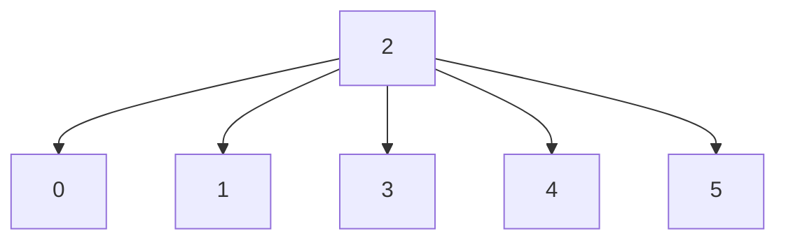
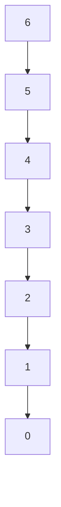

# Time Needed to Inform All Employees
https://leetcode.com/problems/time-needed-to-inform-all-employees/

Similar: `Maximum Depth of Binary Tree`, `Binary Tree Maximum Path Sum`

A company has n employees with a unique ID for each employee from `0` to `n - 1`. The head of the company is the one with `headID`.

Each employee has one direct manager given in the `manager` array where `manager[i]` is the direct manager of the `i-th` employee, `manager[headID] = -1`. Also, it is guaranteed that the subordination relationships have a tree structure.

The head of the company wants to inform all the company employees of an urgent piece of news. He will inform his direct subordinates, and they will inform their subordinates, and so on until all employees know about the urgent news.

The `i-th` employee needs `informTime[i]` minutes to inform all of his direct subordinates (i.e., After informTime[i] minutes, all his direct subordinates can start spreading the news).

Return the number of minutes needed to inform all the employees about the urgent news.

**Example 1:**

    Input: n = 1, headID = 0, manager = [-1], informTime = [0]
    Output: 0
    Explanation: The head of the company is the only employee in the company.

**Example 2:**

    Input: root = [4,9,0,5,1]
    Output: 1026
    Explanation:
    The root-to-leaf path 4->9->5 represents the number 495.
    The root-to-leaf path 4->9->1 represents the number 491.
    The root-to-leaf path 4->0 represents the number 40.
    Therefore, sum = 495 + 491 + 40 = 1026.

**Example 3:**

    Input: n = 7, headID = 6, manager = [1,2,3,4,5,6,-1], informTime = [0,6,5,4,3,2,1]
    Output: 21
    Explanation: The head has id = 6. He will inform employee with id = 5 in 1 minute.
    The employee with id = 5 will inform the employee with id = 4 in 2 minutes.
    The employee with id = 4 will inform the employee with id = 3 in 3 minutes.
    The employee with id = 3 will inform the employee with id = 2 in 4 minutes.
    The employee with id = 2 will inform the employee with id = 1 in 5 minutes.
    The employee with id = 1 will inform the employee with id = 0 in 6 minutes.
    Needed time = 1 + 2 + 3 + 4 + 5 + 6 = 21.

**Example 4:**

    Input: n = 15, headID = 0, manager = [-1,0,0,1,1,2,2,3,3,4,4,5,5,6,6], informTime = [1,1,1,1,1,1,1,0,0,0,0,0,0,0,0]
    Output: 3
    Explanation: The first minute the head will inform employees 1 and 2.
    The second minute they will inform employees 3, 4, 5 and 6.
    The third minute they will inform the rest of employees.

**Example 5:**

    Input: n = 4, headID = 2, manager = [3,3,-1,2], informTime = [0,0,162,914]
    Output: 1076

**Constraints:**

        1 <= n <= 105
        0 <= headID < n
        manager.length == n
        0 <= manager[i] < n
        manager[headID] == -1
        informTime.length == n
        0 <= informTime[i] <= 1000
        informTime[i] == 0 if employee i has no subordinates.
        It is guaranteed that all the employees can be informed.

## Solution 1 - Bottom up recursive DFS
Begin paths from every employee regardless of their position in the tree (they can have superiors and/or subordinates). 
If an employee is uniformed get the time to reach to them from their superior (recursion) then add it to their
respective `informTime` cell. Mark them as informed, so we can get their time in any next iteration. (There is no need 
check their time to get informed by their superiors for every subordinate under them). Return their respective 
`informTime` cell. Return max time of employees.